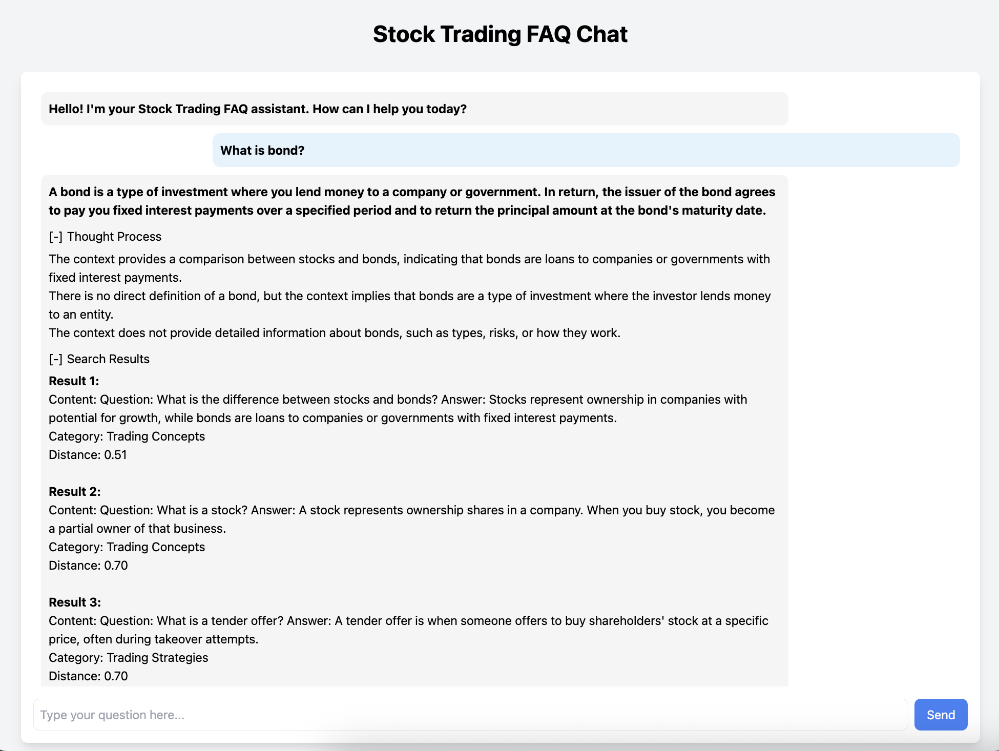

# Stock Trading Assistant 




## Overview

This is a Stock Trading Assistant application built with FastAPI and Timescale Vector. It allows users to ask questions about stock trading and get answers based on a knowledge base, with the ability to see the retrieved context and thought process.

## Features

- FastAPI backend for handling API requests.
- Integration with Timescale Vector for efficient RAG (Retrieval-Augmented Generation).
- Simple HTML/JavaScript frontend for a chat interface.
- Displays AI-generated answers, thought process, and search results with distance scores.
- Collapsible sections for thought process and search results.

## Prerequisites

- Docker and Docker Compose
- Python 3.7+
- Git

## Setup

1.  **Clone the repository:**

    ```bash
    git clone https://github.com/seonokkim/rag-app-fastapi
    cd rag-app-fastapi
    ```

2.  **Set up a Python virtual environment and install dependencies:**

    ```bash
    python -m venv .venv
    source .venv/bin/activate  # On macOS/Linux
    # .venv\Scripts\activate    # On Windows
    
    pip install -r requirements.txt
    ```

3.  **Start the required services using Docker Compose:**

    This project uses Docker Compose to manage services like the database.

    ```bash
    docker compose -f docker/docker-compose.yml up -d
    ```
    This will start the services in detached mode.

4.  **Prepare the database (if necessary):**
    
    *(Instructions for setting up the Timescale Vector database and inserting data would go here. This step might involve running a specific script or connecting to the DB manually. Based on the project structure, `insert_vectors.py` might be relevant.)*

    You might need to run a script to create tables and insert initial data into the database started by Docker Compose. Consult the original project documentation or examine `app/insert_vectors.py` for details.

## Running the Application

1.  **Ensure your Python virtual environment is active:**

    ```bash
    source .venv/bin/activate  # On macOS/Linux
    # .venv\Scripts\activate    # On Windows
    ```

2.  **Start the FastAPI server using Uvicorn:**

    Run the following command from the project root directory:

    ```bash
    uvicorn app.main:app --reload --port 8001
    ```

    -   `app.main`: Refers to the `app` directory and the `main.py` file within it.
    -   `app`: Refers to the FastAPI application instance named `app` inside `main.py`.
    -   `--reload`: Enables auto-reloading on code changes (useful for development).
    -   `--port 8001`: Specifies the port to run the server on. You can change this if port 8001 is already in use.

3.  **Access the application:**

    Once the server is running, open your web browser and go to:

    -   **Chat Interface:** `http://localhost:8001/chat`
    -   **API Documentation (Swagger UI):** `http://localhost:8001/docs`
    -   **API Documentation (Redoc):** `http://localhost:8001/redoc`


### TablePlus (Database Viewer)

TablePlus is a modern, native database tool that allows you to easily browse, query, and manage your database. In this project, it can be used to inspect the data stored in the Timescale Vector database running via Docker.


#### Connecting to the Database with TablePlus

1.  **Ensure Docker Compose services are running:**
    Make sure you have started the database container by running `docker compose -f docker/docker-compose.yml up -d` as described in the [Setup](#setup) section.

2.  **Open TablePlus:**
    Launch the TablePlus application on your computer.

3.  **Create a New Connection:**
    Click on the '+' icon or go to `File > New > Connection`.

4.  **Select PostgreSQL:**
    Choose PostgreSQL as the database type.

5.  **Configure the Connection:**
    Use the following details to connect to the database container:

    -   **Host:** `localhost`
    -   **Port:** `5432` (This is the default exposed port from the docker-compose.yml)
    -   **Database:** `vector_db` (Based on typical Timescale Vector examples, confirm with `docker/docker-compose.yml` if unsure)
    -   **User:** `postgres` (Default user in many setups, confirm with `docker/docker-compose.yml`)
    -   **Password:** `password` (Default password in many setups, confirm with `docker/docker-compose.yml`)
    -   *(Optional)* **Name:** `rag-app-fastapi-db` (Give your connection a descriptive name)

6.  **Test and Connect:**
    Click the 'Test' button to verify the connection details, then click 'Connect'.

You should now be able to browse the tables (like the `vectors` table) and data within the database.

## Project Structure

```
rag-app-fastapi/
├── app/
│   ├── __init__.py
│   ├── main.py             # FastAPI application entry point
│   │   ├── __init__.py
│   │   └── vector_store.py   # Vector store logic
│   ├── services/
│   │   ├── __init__.py
│   │   ├── synthesizer.py    # Response generation logic
│   │   └── llm_factory.py      # LLM client factory
│   ├── config/
│   │   └── settings.py       # Application settings
│   ├── static/             # Static files (if any)
│   └── templates/
│       ├── chat.html         # Chat UI HTML template
│       └── index.html        # (Possibly) Main page template
├── docker/
│   └── docker-compose.yml  # Docker Compose setup
├── data/                   # Data files (e.g., FAQ)
├── requirements.txt        # Python dependencies
└── README.md               # Project README
```


## License

This project is licensed under the [LICENCE](LICENCE) file.

## Acknowledgments

This project is based on the code from [daveebbelaar/pgvectorscale-rag-solution](https://github.com/daveebbelaar/pgvectorscale-rag-solution).

